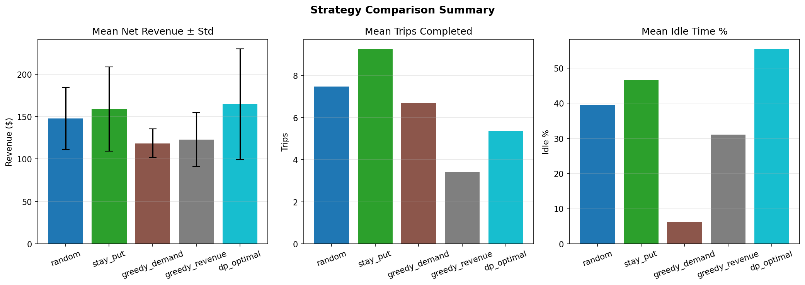
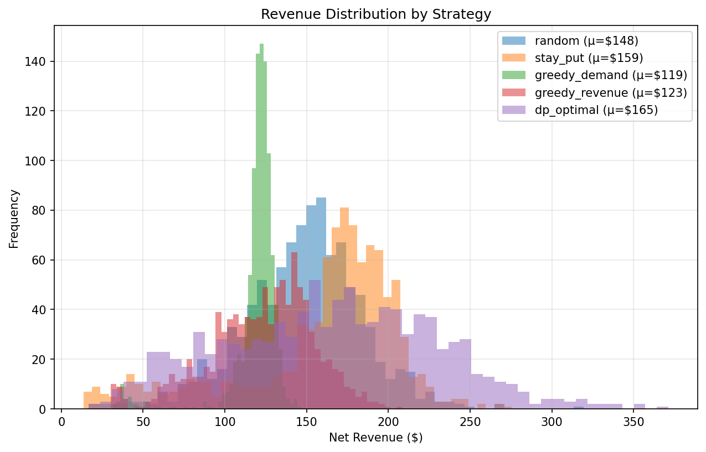
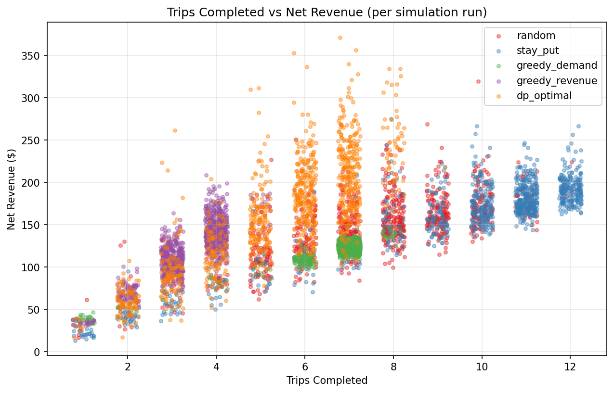
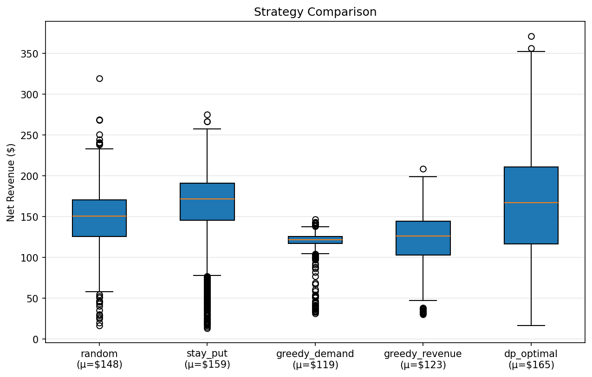
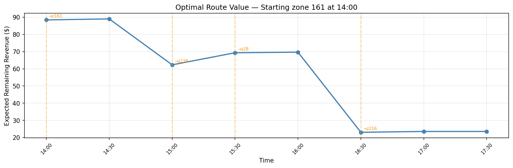

# NYC Taxi Driver Strategy Optimizer


---

## 1. Purpose

This project helps NYC taxi drivers maximize shift revenue by recommending whether to wait in the current zone or reposition to a better one. Given a current zone and time of day, it outputs the optimal action and a full planned route for the rest of the shift.

It works in three stages:

1. **Learn** historical demand and fare patterns from 3M+ real NYC TLC trips
2. **Model** all 260 taxi zones as a weighted directed graph (travel time, fuel cost)
3. **Solve** a dynamic programming problem over the remaining shift to find the globally optimal sequence of repositioning decisions — not just the best next move

The DP-optimal strategy was benchmarked against four baselines across 1000 Monte Carlo simulations (12-hour shift, starting from zone 161 — Midtown Center):



| Strategy | Mean Revenue | Std | Trips | Idle % |
|---|---|---|---|---|
| `dp_optimal` | **$165** | $65 | 5.4 | 55.5% |
| `stay_put` | $159 | $50 | 9.3 | 46.6% |
| `random` | $146 | $38 | 7.3 | 39.6% |
| `greedy_revenue` | $123 | $32 | 3.4 | 31.0% |
| `greedy_demand` | $119 | $17 | 6.7 | 6.2% |

`dp_optimal` earns the most by taking fewer but higher-value trips. All pairwise differences are statistically significant (Welch's t-test, p < 0.05).

---

## 2. Dataset

| Source | Description |
|--------|-------------|
| [NYC TLC Trip Records](https://www.nyc.gov/site/tlc/about/tlc-trip-record-data.page) | Yellow taxi trips in Parquet format (~3M trips/month). Fields: pickup/dropoff zone, datetime, fare, tip, distance. |

US public holidays are generated via the [`holidays`](https://pypi.org/project/holidays/) Python library.

---

## 3. Installation

**Requirements:** Python 3.10+

```bash
git clone https://github.com/Ruoxuann/nyc-taxi-driver-strategy.git
cd nyc-taxi-driver-strategy
pip install -e ".[dev]"
```

---

## 4. Usage

Steps 1–3 are a one-time setup pipeline. Step 4 is the real-time decision tool.

### Step 1 — Download and prepare data

```bash
python -m nyc_taxi_strategy.data.download --months 2024-01 2024-02 2024-03
python -m nyc_taxi_strategy.data.etl --config configs/default.yaml
```

Downloads raw parquet files to `data/raw/` and aggregates them into a SQLite database at `data/nyc_taxi.db`. Missing months are skipped with a warning.

### Step 2 — Train demand and fare models

```bash
python -m nyc_taxi_strategy.models.train --config configs/default.yaml
```

Trains two gradient boosting models — expected pickup wait time and expected fare — and saves them to `results/models/`.

### Step 3 — Run strategy simulation

```bash
python -m nyc_taxi_strategy.simulation.run --config configs/default.yaml --strategy all --start-zone 161
```

Runs 1000 Monte Carlo shifts per strategy from the specified starting zone. `--start-zone` defaults to zone 1 if omitted. Use `--strategy dp_optimal` to run a single strategy.

Available strategies: `random`, `stay_put`, `greedy_demand`, `greedy_revenue`, `dp_optimal`.

### Step 4 — Query the optimal action

```bash
python -m nyc_taxi_strategy.query --zone <ZONE_ID> --time <HH:MM>
```

Given a current zone and time, outputs whether to stay or reposition, the expected gain, and the full planned route for the rest of the shift.

```
$ python -m nyc_taxi_strategy.query --zone 161 --time 14:00

=======================================================
  Current zone : 161
  Current time : 14:00  (slot 16 of 24)
  Shift ends   : 18:00
=======================================================

  [Stay in current zone]
    Expected wait     : 1.0 min
    Expected fare     : $13.69
    Expected value    : $81.34  (remaining shift)

  [Reposition to zone 226]
    Travel time       : 21.6 min  (arrive at 14:30)
    Fuel cost         : $0.59
    Expected wait     : 29.5 min
    Expected fare     : $20.82
    Expected value    : $88.42  (remaining shift after travel cost)

  Recommendation: REPOSITION to zone 226
  Expected gain over staying: $+7.08

  Optimal policy from current time onwards:
  Time     Zone     Action                Expected Value
  -----------------------------------------------------
  14:00    161      go to zone 226       $         88.42
  14:30    226      stay                 $         89.01
  15:00    226      go to zone 28        $         62.30
  15:30    28       go to zone 216       $         69.32
  16:00    216      stay                 $         69.68
  16:30    216      go to zone 132       $         23.07
  17:00    132      stay                 $         23.56
  17:30    132      stay                 $         23.56
```

### Step 5 — Compare and visualize strategies

```bash
# Print comparison table
python -m nyc_taxi_strategy.evaluation.compare --config configs/default.yaml

# Generate strategy comparison charts
python -m nyc_taxi_strategy.evaluation.visualize --type strategies --output-dir results/figures

# Generate optimal route chart for a specific query
python -m nyc_taxi_strategy.evaluation.visualize --type route --zone 161 --time 14:00 --output-dir results/figures
```

---

## Visualizations

**Revenue distributions** — `dp_optimal` (purple) has a wider spread but higher mean; `greedy_demand` (green) is tightly clustered at a low value.



**Trips vs revenue** — `dp_optimal` (blue) earns more than other strategies at the same trip count, confirming it selects higher-value trips.



**Box plot** — `dp_optimal` has the highest median but also the largest spread; `greedy_demand` is consistent but consistently low.



**Route value timeline** — expected remaining shift revenue at each 30-minute slot. Orange dashed lines mark repositioning decisions.



---

## Project Structure

```
nyc-taxi-driver-strategy/
├── nyc_taxi_strategy/
│   ├── data/          # Download, cleaning, ETL
│   ├── graph/         # Zone graph, Dijkstra, DP engine
│   ├── features/      # Feature transformers and pipeline
│   ├── models/        # ML models, train/save
│   ├── simulation/    # Shift simulator, Monte Carlo runner
│   ├── evaluation/    # Strategy comparison and visualization
│   ├── query.py       # Real-time decision query
│   └── utils/         # Config loader, logging
├── tests/
├── configs/default.yaml
└── pyproject.toml
```

---

## Running Tests

```bash
pytest tests/ -v --cov=nyc_taxi_strategy --cov-report=term-missing
```

---

## License

MIT
